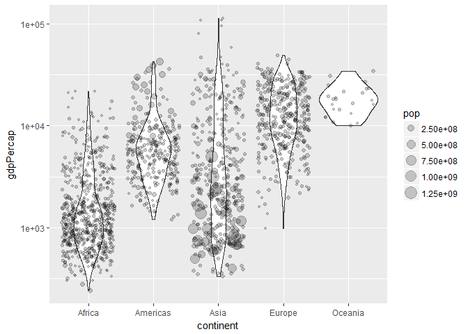

STAT545 hw03
================

<style type="text/css">
.twoC {width: 100%}
.twoCl {width: 100%}
.clearer {clear: both}
.twoC table {max-width: 35%; float: left; max-height: 430px}
.twoC img {max-width: 65%; float: right}
.twoCl table {max-width: 35%; float: left; max-height: 860px}
.twoCl img {max-width: 65%; float: right}
</style>

## Setting ups

First we need to install and load packages.

``` r
#install.packages("tidyverse")
#install.packages("gapminder")
suppressPackageStartupMessages(library(tidyverse))
suppressPackageStartupMessages(library(gapminder))
```

Now we are ready to go\!

## Tasks

### Get the maximum and minimum of GDP per capita for all continents.

``` r
a <- gapminder %>%
  group_by(continent) %>%
  summarise(min = min(gdpPercap),
            max = max(gdpPercap)) %>%
  gather("type", "value", min:max)

knitr::kable(a)

a %>% ggplot(aes(x = continent, fill = type)) + 
  geom_bar(aes(y = value), stat = "identity", position="dodge") +
  scale_y_log10()
```

<div class="twoC">

| continent | type |       value |
| :-------- | :--- | ----------: |
| Africa    | min  |    241.1659 |
| Americas  | min  |   1201.6372 |
| Asia      | min  |    331.0000 |
| Europe    | min  |    973.5332 |
| Oceania   | min  |  10039.5956 |
| Africa    | max  |  21951.2118 |
| Americas  | max  |  42951.6531 |
| Asia      | max  | 113523.1329 |
| Europe    | max  |  49357.1902 |
| Oceania   | max  |  34435.3674 |

<!-- -->

</div>

<div class="clearer">

</div>

### Look at the spread of GDP per capita within the continents.

``` r
a <- gapminder %>%
  group_by(continent) %>%
  select(continent, gdpPercap) %>%
  summarise(min = min(gdpPercap),
            max = max(gdpPercap),
            mean = mean(gdpPercap),
            Qu1 = quantile(gdpPercap, 0.25),
            median = median(gdpPercap),
            Qu3 = quantile(gdpPercap, 0.75))

knitr::kable(a)

gapminder %>%
  ggplot(aes(x = gdpPercap, group = continent, color = continent)) +
  geom_density() +
  scale_x_log10()
```

<div class="twoC">

| continent |        min |       max |      mean |       Qu1 |    median |       Qu3 |
| :-------- | ---------: | --------: | --------: | --------: | --------: | --------: |
| Africa    |   241.1659 |  21951.21 |  2193.755 |   761.247 |  1192.138 |  2377.417 |
| Americas  |  1201.6372 |  42951.65 |  7136.110 |  3427.779 |  5465.510 |  7830.210 |
| Asia      |   331.0000 | 113523.13 |  7902.150 |  1056.993 |  2646.787 |  8549.256 |
| Europe    |   973.5332 |  49357.19 | 14469.476 |  7213.085 | 12081.749 | 20461.386 |
| Oceania   | 10039.5956 |  34435.37 | 18621.609 | 14141.859 | 17983.304 | 22214.117 |

<!-- -->

</div>

<div class="clearer">

</div>

### Compute a mean life expectency weighted by population.

``` r
a <- gapminder %>%
  group_by(year) %>%
  summarise(wtd_lifeExp = weighted.mean(lifeExp, pop))

knitr::kable(a)

a %>% ggplot(aes(year, wtd_lifeExp)) + 
  geom_point() + 
  geom_line()
```

<div class="twoC">

| year | wtd\_lifeExp |
| ---: | -----------: |
| 1952 |     48.94424 |
| 1957 |     52.12189 |
| 1962 |     52.32438 |
| 1967 |     56.98431 |
| 1972 |     59.51478 |
| 1977 |     61.23726 |
| 1982 |     62.88176 |
| 1987 |     64.41635 |
| 1992 |     65.64590 |
| 1997 |     66.84934 |
| 2002 |     67.83904 |
| 2007 |     68.91909 |

<!-- -->

</div>

<div class="clearer">

</div>

### How is life expectancy changing over time on different continents?

``` r
a <- gapminder %>%
  group_by(continent, year) %>%
  summarise(wtd_lifeExp = weighted.mean(lifeExp, pop))

knitr::kable(a)

a %>% ggplot(aes(year, wtd_lifeExp)) + 
  geom_point(aes(color = continent)) + 
  geom_line(aes(color = continent)) +
  geom_smooth(method = "loess")
```

<div class="twoC">

| continent | year | wtd\_lifeExp |
| :-------- | ---: | -----------: |
| Africa    | 1952 |     38.79973 |
| Africa    | 1957 |     40.94031 |
| Africa    | 1962 |     43.09925 |
| Africa    | 1967 |     45.17721 |
| Africa    | 1972 |     47.21229 |
| Africa    | 1977 |     49.20883 |
| Africa    | 1982 |     51.01744 |
| Africa    | 1987 |     52.82479 |
| Africa    | 1992 |     53.37292 |
| Africa    | 1997 |     53.28327 |
| Africa    | 2002 |     53.30314 |
| Africa    | 2007 |     54.56441 |
| Americas  | 1952 |     60.23599 |
| Americas  | 1957 |     62.01806 |
| Americas  | 1962 |     63.43706 |
| Americas  | 1967 |     64.50630 |
| Americas  | 1972 |     65.70490 |
| Americas  | 1977 |     67.60591 |
| Americas  | 1982 |     69.19264 |
| Americas  | 1987 |     70.35814 |
| Americas  | 1992 |     71.72177 |
| Americas  | 1997 |     73.19154 |
| Americas  | 2002 |     74.24736 |
| Americas  | 2007 |     75.35668 |
| Asia      | 1952 |     42.94114 |
| Asia      | 1957 |     47.28835 |
| Asia      | 1962 |     46.57369 |
| Asia      | 1967 |     53.88261 |
| Asia      | 1972 |     57.52159 |
| Asia      | 1977 |     59.55648 |
| Asia      | 1982 |     61.57472 |
| Asia      | 1987 |     63.53710 |
| Asia      | 1992 |     65.14874 |
| Asia      | 1997 |     66.77092 |
| Asia      | 2002 |     68.13732 |
| Asia      | 2007 |     69.44386 |
| Europe    | 1952 |     64.90540 |
| Europe    | 1957 |     66.89364 |
| Europe    | 1962 |     68.45957 |
| Europe    | 1967 |     69.54963 |
| Europe    | 1972 |     70.46884 |
| Europe    | 1977 |     71.53989 |
| Europe    | 1982 |     72.56247 |
| Europe    | 1987 |     73.44717 |
| Europe    | 1992 |     74.44273 |
| Europe    | 1997 |     75.70849 |
| Europe    | 2002 |     77.02232 |
| Europe    | 2007 |     77.89057 |
| Oceania   | 1952 |     69.17040 |
| Oceania   | 1957 |     70.31693 |
| Oceania   | 1962 |     70.98808 |
| Oceania   | 1967 |     71.17848 |
| Oceania   | 1972 |     71.92273 |
| Oceania   | 1977 |     73.25684 |
| Oceania   | 1982 |     74.58291 |
| Oceania   | 1987 |     75.98107 |
| Oceania   | 1992 |     77.35788 |
| Oceania   | 1997 |     78.61843 |
| Oceania   | 2002 |     80.16006 |
| Oceania   | 2007 |     81.06215 |

<!-- -->

</div>

<div class="clearer">

</div>

### Report the absolute and/or relative abundance of countries with low life expectancy over time by continent.

``` r
a <- gapminder %>%
  group_by(continent, year) %>%
  mutate(wtd_lifeExp = weighted.mean(lifeExp, pop)) %>%
  summarise(low_ct = sum(lifeExp < wtd_lifeExp),
            low_ct_rl = low_ct/length(country))

knitr::kable(a)

a %>% ggplot(aes(year, low_ct)) + 
  geom_point(aes(color = continent)) + 
  geom_line(aes(color = continent))

a %>% ggplot(aes(year, low_ct_rl)) + 
  geom_point(aes(color = continent)) + 
  geom_line(aes(color = continent))
```

<div class="twoCl">

| continent | year | low\_ct | low\_ct\_rl |
| :-------- | ---: | ------: | ----------: |
| Africa    | 1952 |      26 |   0.5000000 |
| Africa    | 1957 |      27 |   0.5192308 |
| Africa    | 1962 |      28 |   0.5384615 |
| Africa    | 1967 |      28 |   0.5384615 |
| Africa    | 1972 |      27 |   0.5192308 |
| Africa    | 1977 |      26 |   0.5000000 |
| Africa    | 1982 |      27 |   0.5192308 |
| Africa    | 1987 |      28 |   0.5384615 |
| Africa    | 1992 |      27 |   0.5192308 |
| Africa    | 1997 |      28 |   0.5384615 |
| Africa    | 2002 |      29 |   0.5576923 |
| Africa    | 2007 |      29 |   0.5576923 |
| Americas  | 1952 |      19 |   0.7600000 |
| Americas  | 1957 |      17 |   0.6800000 |
| Americas  | 1962 |      16 |   0.6400000 |
| Americas  | 1967 |      15 |   0.6000000 |
| Americas  | 1972 |      13 |   0.5200000 |
| Americas  | 1977 |      15 |   0.6000000 |
| Americas  | 1982 |      15 |   0.6000000 |
| Americas  | 1987 |      15 |   0.6000000 |
| Americas  | 1992 |      15 |   0.6000000 |
| Americas  | 1997 |      15 |   0.6000000 |
| Americas  | 2002 |      15 |   0.6000000 |
| Americas  | 2007 |      16 |   0.6400000 |
| Asia      | 1952 |      12 |   0.3636364 |
| Asia      | 1957 |      16 |   0.4848485 |
| Asia      | 1962 |      12 |   0.3636364 |
| Asia      | 1967 |      17 |   0.5151515 |
| Asia      | 1972 |      18 |   0.5454545 |
| Asia      | 1977 |      14 |   0.4242424 |
| Asia      | 1982 |      12 |   0.3636364 |
| Asia      | 1987 |      12 |   0.3636364 |
| Asia      | 1992 |      11 |   0.3333333 |
| Asia      | 1997 |      11 |   0.3333333 |
| Asia      | 2002 |      11 |   0.3333333 |
| Asia      | 2007 |      11 |   0.3333333 |
| Europe    | 1952 |      12 |   0.4000000 |
| Europe    | 1957 |      12 |   0.4000000 |
| Europe    | 1962 |      10 |   0.3333333 |
| Europe    | 1967 |      10 |   0.3333333 |
| Europe    | 1972 |      11 |   0.3666667 |
| Europe    | 1977 |      13 |   0.4333333 |
| Europe    | 1982 |      12 |   0.4000000 |
| Europe    | 1987 |      12 |   0.4000000 |
| Europe    | 1992 |      12 |   0.4000000 |
| Europe    | 1997 |      13 |   0.4333333 |
| Europe    | 2002 |      13 |   0.4333333 |
| Europe    | 2007 |      12 |   0.4000000 |
| Oceania   | 1952 |       1 |   0.5000000 |
| Oceania   | 1957 |       1 |   0.5000000 |
| Oceania   | 1962 |       1 |   0.5000000 |
| Oceania   | 1967 |       1 |   0.5000000 |
| Oceania   | 1972 |       1 |   0.5000000 |
| Oceania   | 1977 |       1 |   0.5000000 |
| Oceania   | 1982 |       1 |   0.5000000 |
| Oceania   | 1987 |       1 |   0.5000000 |
| Oceania   | 1992 |       1 |   0.5000000 |
| Oceania   | 1997 |       1 |   0.5000000 |
| Oceania   | 2002 |       1 |   0.5000000 |
| Oceania   | 2007 |       1 |   0.5000000 |

<!-- --><!-- -->

</div>

<div class="clearer">

</div>

### Find countries with interesting stories.

Interesting stories always come from changes. So first I calculate the
range of life expectency, population, gdp per capita and whole gdp for
each country.

``` r
a <- gapminder %>%
  mutate(gdp = gdpPercap * pop) %>%
  group_by(country) %>%
  summarise(range_life = max(lifeExp) - min(lifeExp),
            range_pop = max(pop) - min(pop),
            range_gpc = max(gdpPercap) - min(gdpPercap),
            range_gdp = max(gdp) - min(gdp))
```

Now we can check the data and plot for the most various countries.

``` r
knitr::kable(head(arrange(a, desc(range_life))))
range_lif <- filter(gapminder, country %in% select(head(arrange(a, desc(range_life))), country)$country)
range_lif %>% ggplot(aes(year, lifeExp, color=country)) + geom_point() + geom_line()
```

| country      | range\_life | range\_pop | range\_gpc |   range\_gdp |
| :----------- | ----------: | ---------: | ---------: | -----------: |
| Oman         |      38.062 |    2697064 |   20487.96 | 7.059266e+10 |
| Vietnam      |      33.837 |   59015517 |    1836.51 | 1.922935e+11 |
| Indonesia    |      33.182 |  141495000 |    2790.97 | 7.299892e+11 |
| Saudi Arabia |      32.902 |   23595361 |   27708.21 | 5.718209e+11 |
| Libya        |      31.229 |    5017185 |   19563.66 | 7.035543e+10 |
| Korea, Rep.  |      31.170 |   28097219 |   22317.55 | 1.123516e+12 |

<!-- -->

``` r
knitr::kable(head(arrange(a, desc(range_pop))))
range_pop <- filter(gapminder, country %in% select(head(arrange(a, desc(range_pop))), country)$country)
range_pop %>% ggplot(aes(year, pop, color=country)) + geom_point() + geom_line()
```

| country       | range\_life | range\_pop | range\_gpc |   range\_gdp |
| :------------ | ----------: | ---------: | ---------: | -----------: |
| China         |      28.961 |  762419569 |   4558.666 | 6.316746e+12 |
| India         |      27.325 |  738396331 |   1905.645 | 2.519603e+12 |
| United States |       9.802 |  143586947 |  28961.171 | 1.073022e+13 |
| Indonesia     |      33.182 |  141495000 |   2790.970 | 7.299892e+11 |
| Brazil        |      21.473 |  133408087 |   6956.856 | 1.603227e+12 |
| Pakistan      |      22.047 |  127924057 |   1921.350 | 4.128046e+11 |

<!-- -->

``` r
knitr::kable(head(arrange(a, desc(range_gpc))))
range_gpc <- filter(gapminder, country %in% select(head(arrange(a, desc(range_gpc))), country)$country)
range_gpc %>% ggplot(aes(year, gdpPercap, color=country)) + geom_point() + geom_line()
```

| country          | range\_life | range\_pop | range\_gpc |   range\_gdp |
| :--------------- | ----------: | ---------: | ---------: | -----------: |
| Kuwait           |      22.023 |    2345559 |   85404.70 | 101189277542 |
| Singapore        |      19.576 |    3426009 |   44828.04 | 212034160408 |
| Norway           |       7.526 |    1300198 |   39261.77 | 194826606145 |
| Hong Kong, China |      21.248 |    4854512 |   36670.56 | 270803323760 |
| Ireland          |      11.975 |    1279086 |   35465.72 | 151759606806 |
| Austria          |      13.029 |    1272011 |   29989.42 | 253713134008 |

<!-- -->

``` r
knitr::kable(head(arrange(a, desc(range_gdp))))
range_gdp <- filter(gapminder, country %in% select(head(arrange(a, desc(range_gdp))), country)$country)
range_gdp %>% ggplot(aes(year, gdpPercap * pop, color=country)) + geom_point() + geom_line()
```

| country       | range\_life | range\_pop | range\_gpc |   range\_gdp |
| :------------ | ----------: | ---------: | ---------: | -----------: |
| United States |       9.802 |  143586947 |  28961.171 | 1.073022e+13 |
| China         |      28.961 |  762419569 |   4558.666 | 6.316746e+12 |
| Japan         |      19.573 |   41008947 |  28439.112 | 3.757000e+12 |
| India         |      27.325 |  738396331 |   1905.645 | 2.519603e+12 |
| Germany       |      11.906 |   13255044 |  25026.260 | 2.156884e+12 |
| Brazil        |      21.473 |  133408087 |   6956.856 | 1.603227e+12 |

<!-- -->
